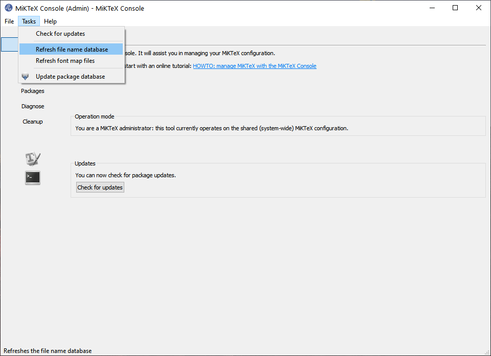
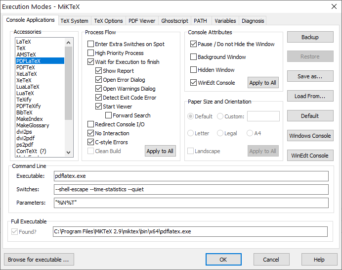
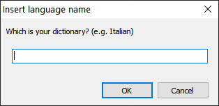
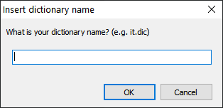
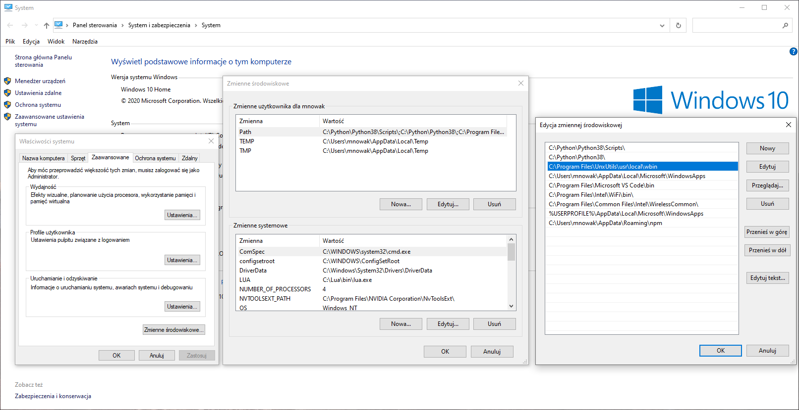
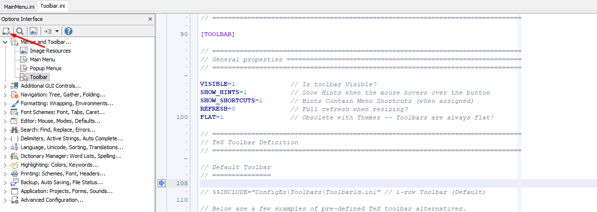
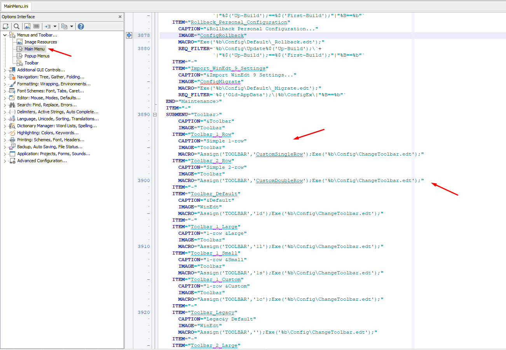
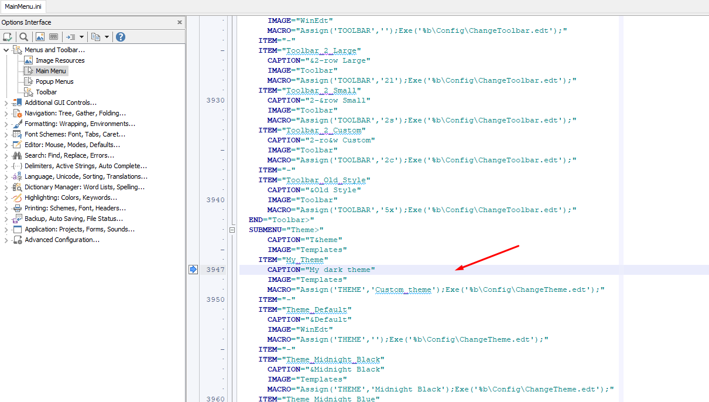
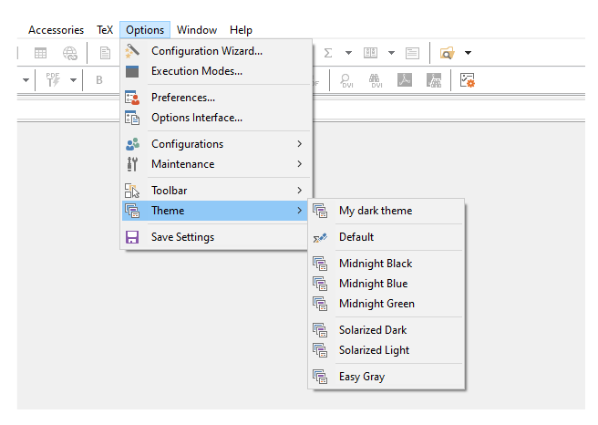
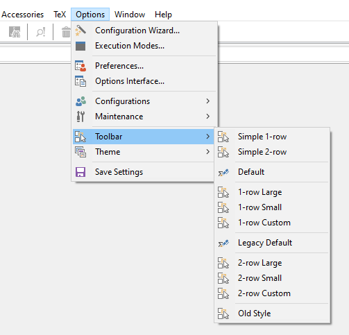

# Overview

1. LaTeX installation (with python) on Windows
2. Customization of LaTeX editor - WinEdt 10

## LaTeX installation (with python) on Windows

1. Download and install [MikTeX](https://miktex.org/download) and [gnuplot (optional)](https://sourceforge.net/projects/gnuplot/files/gnuplot/5.2.8/)
   - Open `MikTeX` and switch to *MikTeX administrator mode*

   - Click the `check for updates` button and wait until to done process

   - Go to `Updates` tab and click `update` button (you can also change the source of installation in the `Install from` field)

   - Click `Tasks` tab and click `Refresh file name database`
     

2. (*Optional*) Download `logicpuzzle` from [here](./install/packages)
   - Add logicpuzzle folder (package) to `some-path\MiKTeX 2.9\tex\latex`
   - Open `MikTeX` and switch to *MikTeX administrator mode*
   - Click the `Tasks` tab and click `Refresh file name database` as like in the first point

3. Download and install LaTeX editor
   - [WinEdt (Commercial license)](https://www.winedt.com/download.html)
     - Configure settings in WinEdt

       - Click the `options` tab and choose `Execution Modes...` and fill switches options like on the image
         

     - Download dictionary with `.dic` extension. In this repository is only [polish dictionary](./install/dictionary/pl.dic)

     - Download [dictionary installation macro](./install/dictionary/InstallDict.edt) and next open it in editor

     - Click `Macros` tab and click `Execute Current Macro`

     - Next will be showed following window. Write language (for me is *Polish*) and click `OK`
       

     - Next will show last window. Write filename of dictionary with extension
       

   - [TexStudio (Free license)](https://www.texstudio.org/)
     - Click `Options` and choose `Configure TeXStudio`

     - In `Commands` tab in `PdfLaTeX` compiler add `--shell-escape` option before `%.tex`

     - In the `Spell check` tab can install additional dictionaries. Just click `Import dictionary...` and next choose dictionary file with `.oxt` extension

4. (*Optional*) Installation python extension in LaTeX
   - Download [Python](https://www.python.org/downloads/) and install it. Remember to check the option to add `python` to `PATH` during installation.

   - Download [UnxUtils](https://sourceforge.net/projects/unxutils/) and install it. Next, you must add to the user `path` this `some-path\UnxUtils\usr\local\wbin`.
     

   - Open a command prompt and write `pip install pyx`

5. (*Optional*) Installation PythonTeX extension in WinEdt
   - Download [PythonTeX (supported by WinEdt)](http://www.winedt.org/config/menus/PythonTeX.html)

   - How to install this extension is described on the clicked at link website

### Example test files

1. [Basic test file](./install/test-files/basic-test-file.tex)
2. [Python test file](./install/test-files/python-intersecting-rings.tex)

## Customization of LaTex editor - WinEdt 10

### How to add own styles and files to your WinEdt 10 editor

- Folder, where you can add your own definition of the toolbar &#8594; `C:\Program Files\WinEdt Team\WinEdt 10\ConfigEx\Toolbars`
- Folder, where you can add your editor theme/skin &#8594; `C:\Program Files\WinEdt Team\WinEdt 10\ConfigEx\Themes`
- Folder, where you must move files from `user-options` &#8594; `C:\Users\user\AppData\Roaming\WinEdt Team\WinEdt 10\ConfigEx`

### Troubleshooting

Any change in `toolbar` or `theme` files make it that, you must make some changes in a few lines in files from `user-options`.
The best way to do this is find old names and replace them with new ones.

If some problems come up, just analyze how works adding elements mechanism to WinEdt interface, based on originals instructions/commands.

### Screenshots

#### If any changes have been made in any file then after saving it, you must click the `Load current script` button

#### Toolbar

#### Theme

#### After changes

After clicking the `Load current script` button, the changes should be shown

### Useful links

- [Editor themes](https://atomcorp.github.io/themes/)

## Notes

The example theme in the repository was created based on [Gatito Theme](https://github.com/pawelgrzybek/gatito-theme) and Winedt Midnight Blue theme.

Feel free to write any suggestions :smirk:

